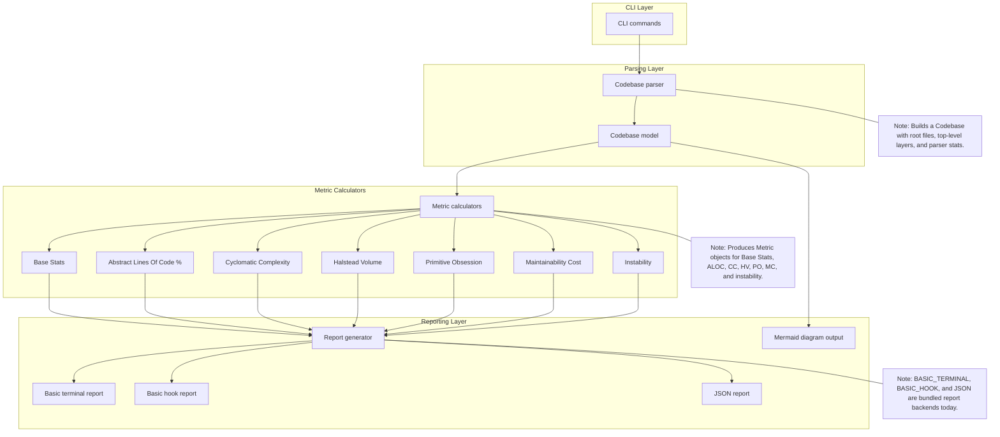

```mermaid
flowchart TD
    subgraph "CLI Layer"
        CLIParser["CLI commands"]
    end

    subgraph "Parsing Layer"
        DirReader["Codebase parser"]
        Codebase["Codebase model"]
    end

    subgraph "Metric Calculators"
        MetricsCalc["Metric calculators"]
        BaseStats["Base Stats"]
        ALOC["Abstract Lines Of Code %"]
        CC["Cyclomatic Complexity"]
        HV["Halstead Volume"]
        PO["Primitive Obsession"]
        MC["Maintainability Cost"]
        LI["Instability"]
    end

    subgraph "Reporting Layer"
        ReportGen["Report generator"]
        BasicReport["Basic terminal report"]
        HookReport["Basic hook report"]
        JsonReport["JSON report"]
        Diagram["Mermaid diagram output"]
    end

    CLIParser --> DirReader
    DirReader --> Codebase
    Codebase --> MetricsCalc

    MetricsCalc --> BaseStats
    MetricsCalc --> ALOC
    MetricsCalc --> CC
    MetricsCalc --> HV
    MetricsCalc --> PO
    MetricsCalc --> MC
    MetricsCalc --> LI

    BaseStats --> ReportGen
    ALOC --> ReportGen
    CC --> ReportGen
    HV --> ReportGen
    PO --> ReportGen
    MC --> ReportGen
    LI --> ReportGen

    ReportGen --> BasicReport
    ReportGen --> HookReport
    ReportGen --> JsonReport
    Codebase --> Diagram

    %% Notes attached to nodes
    DirReader --- NoteCodebase
    NoteCodebase["Note: Builds a Codebase with root files, top-level layers, and parser stats."]

    MetricsCalc --- NoteMetric
    NoteMetric["Note: Produces Metric objects for Base Stats, ALOC, CC, HV, PO, MC, and instability."]

    ReportGen --- NoteReport
    NoteReport["Note: BASIC_TERMINAL, BASIC_HOOK, and JSON are bundled report backends today."]
```
